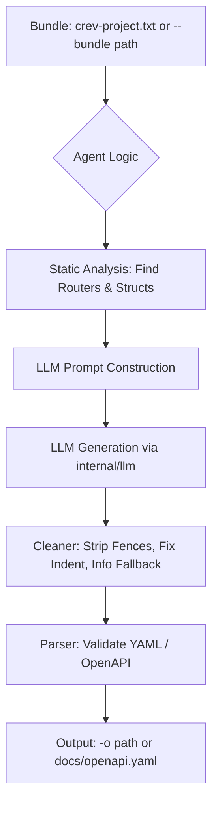

To build a robust API documentation agent, we need to transition from a "simple text generator" to a "code-aware schema architect."

I have modified your plan to include **logic for validation tags**, **middleware security discovery**, and **circular reference handling**—all of which are common pain points when generating docs from source code. The first version targets **Go** (routers, struct tags, net/http); Rust/TypeScript can follow with the same pipeline and language-specific patterns.

---

## 🛠 Refined LLM-Powered API Docs Agent Plan

### 1. Expanded OpenAPI "Intelligence"

The agent will now look for these specific code patterns to ensure the YAML is functional, not just descriptive:

* **Validation Constraints:** Map struct tags (e.g., `validate:"required,min=8"`) to OpenAPI properties (`minLength: 8`).
* **Enum Inference:** Detect `const` blocks near type definitions to populate the `enum` field in the schema.
* **Security Context:** Scan for middleware usage (e.g., `.Use(AuthMiddleware)`) to auto-apply `security: - bearerAuth: []` to specific route groups.
* **Circular Reference Breaking:** Instruct the LLM to detect recursive types (e.g., User has a Post, Post has an Author) and flatten the nested reference to an ID to prevent infinite loops in Swagger UI.
* **Interface-to-Implementation Resolution:** When a handler passes `interface{}` or `any` to a serializer (e.g. `c.JSON(200, resp)`), trace back to the variable’s initialization and resolve the concrete struct so the response schema is documented.
* **Hidden Route Definitions:** Treat functions that accept a router (e.g. `*gin.Engine`, `*mux.Router`, `http.Handler`) as sub-routers; their internal route definitions belong to the primary API tree even when spread across files.
* **Response Headers & Cookies:** Detect `w.Header().Set()` or `c.Header()` (and similar) and document consistently set headers (e.g. `X-Total-Count`, `Set-Cookie`) in the OpenAPI `headers` object for the relevant response status.

---

### 2. Implementation Roadmap (Modified)

#### **A. internal/apidocs/prompt.go (The "Brain")**

The prompt needs to be highly structured. We will implement it as two **prompt blocks** (sub-prompts) in `prompt.go`:

1. **The Mapper**
   * Convert Go types to OpenAPI 3.1: e.g. `json:"user_id"` → property `user_id`; `validate:"required"` → add to `required` array.
   * **Side-Effect Analysis:** Detect calls to `w.Header().Set()` or `c.Header()`. If a header is consistently set (e.g. `X-Total-Count`, pagination or rate-limit headers), include it in the OpenAPI `headers` object for that response status.

2. **The Architect**
   * Identify the "Entry Points" (Routers). Follow the function calls to find the Handlers. Identify the DTOs passed to encoders/decoders.
   * **Trace-to-Definition:** If a response variable is passed to a serializer (e.g. `c.JSON(200, resp)`), trace back to its initialization. If it is an `interface{}` or `any`, look for the concrete struct assignment within the same function scope and document that type.
   * **Global Discovery:** Scan all files for functions that accept a router object (e.g. `*gin.Engine`, `*mux.Router`, `http.Handler`) as an argument. These are sub-routers; treat their internal route definitions as part of the primary API tree.

#### **B. internal/apidocs/agent.go (The "Worker")**

Orchestration only. Post-processing is delegated to **cleaner.go** and **parser.go**:

* **cleaner.go** performs the "dirty work": strip Markdown fences, fix common LLM indentation errors, and ensure the `info` section has a fallback title/version.
* **parser.go** validates the result (e.g. ghodss/yaml or kin-openapi).
* **Self-Correction Loop (Optional):** If the generated YAML fails validation after cleaning, the agent sends the error back to the LLM once for a "fix-up" pass.

#### **C. cmd/docs.go (The "Interface")**

The docs command reuses the same config as `crev review`: **CREV_API_KEY** (env or `crev_api_key` in `.crev-config.yaml`) and the existing **internal/llm** client—no new LLM abstraction. Input is the same bundle used for review: by default read **crev-project.txt** (run `crev bundle` first), or accept a path via `--bundle`.

Enhanced CLI flags:

* `--format`: Choose between `yaml` or `json`.
* `--output` / `-o`: Output path (default: `docs/openapi.yaml`). Overwrites the file if it exists.
* `--title`: Override the API title.
* `--v31`: Emit `openapi: 3.1.0` and use 3.1-only features where applicable (better for modern tools).

---

### 3. Revised Architecture Diagram

---

### 4. Key Logic Updates for the Bundle

| Feature | Strategy |
| --- | --- |
| **Recursive Schemas** | If `Type A` references `Type B` and vice-versa, the LLM is instructed to use `$ref` for the first level and `type: string (UUID)` for the second level. |
| **External Types** | Since `github.com/google/uuid` won't be in the bundle, the LLM maps it to `type: string, format: uuid` based on common knowledge (or via a small built-in map of known packages). |
| **Error Handling** | The agent scans for standard error patterns to document responses (e.g. Go: `http.Error(w, ..., http.StatusNotFound)`; frameworks like Gin/Echo: `c.JSON(404, ...)` or equivalent). Automatically document `404` (and other statuses) when detected. |
| **Generics Support** | If the code uses `Response[T]` or similar generics, instruct the LLM to generate a concrete schema name (e.g. `UserResponse`) by substituting `T` with the concrete type used at the call site. |
| **Multi-File Context** | Explicitly tell the LLM that the bundle (e.g. `crev-project.txt`) is a concatenated stream; it must use the `--- path/to/file.go ---` (or equivalent) markers to maintain file-to-package mapping and trace types across files. |
| **Pagination Patterns** | Instruct the LLM to recognize common query parameters such as `page`, `limit`, or `offset` even when they are not declared in a dedicated "Params" struct. |

---

### 5. Updated File Structure (Final)

* `internal/apidocs/agent.go`: Orchestration only; depends on **internal/llm** (existing `Client`) and optionally **internal/bundle** or file input. Delegates post-processing to cleaner and parser.
* `internal/apidocs/prompt.go`: System instructions and Go-to-OpenAPI mapping rules (Mapper + Architect prompt blocks, including Trace-to-Definition, Global Discovery, and Side-Effect Analysis).
* `internal/apidocs/cleaner.go`: **(New)** Strip Markdown fences, fix common LLM indentation errors, and ensure the `info` section has a fallback title/version before validation.
* `internal/apidocs/parser.go`: Validate the cleaned output (e.g. **ghodss/yaml** or **kin-openapi**); unit-test validation logic.
* `cmd/docs.go`: The CLI entry point (same Viper/API key pattern as `review`).
